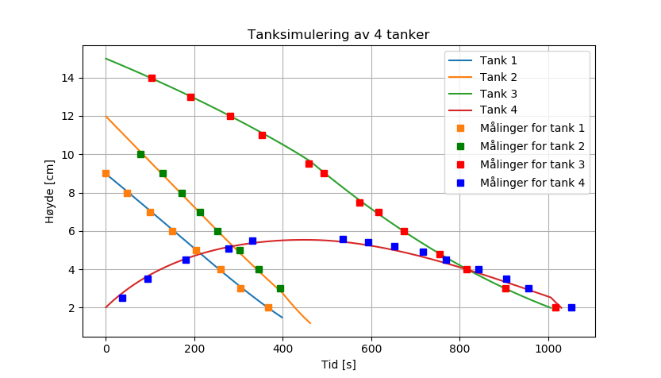

# Prosjektoppgave for ProgMod våren 2018
Prosjektet simulerer 4 tanker som renner over i hverandre ved hjelp av eulers metode og er programmert i Python. Systemet består av tre koniske og en rektangulær tank. Prosjektet inneholder også en visualisering av simuleringen laget i PyGame.
[Oppgaveformulering](https://github.com/fagstoff/ProgMod/blob/master/Prosjektoppgaver/Gode_tanker.md)

### Simulering m/ måledata

### Visualisering

